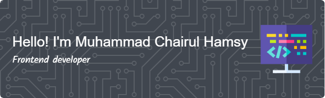

## 💫 About Me:
### 👋 Hi, I'm Muhammad Chairul Hamsy

I'm a passionate **web developer** and student based in **Binjai, Indonesia**. I'm currently focusing on improving my skills in **JavaScript** and **React**, and I enjoy building responsive, accessible, and user-friendly web applications.

#### 🚀 What I'm Working On
Right now, I'm working on several personal projects to enhance my front-end development skills, and I'm in the process of building my **developer portfolio**. I’m also actively exploring open-source projects to learn from real-world codebases and contribute to the developer community.

#### 💡 My Interests
- Building dynamic and interactive user interfaces with React
- Exploring full-stack development
- Learning best practices in clean code, performance, and accessibility
- Collaborating with other developers and learning from open-source projects

#### 🎯 Goals
- Become a professional web developer
- Contribute consistently to open-source
- Create and maintain meaningful side projects
- Build a strong portfolio that reflects my growth and creativity

#### 🎮 Fun Facts About Me
When I’m not in front of my code editor, I love spending time playing games—it's a great way to relax and also inspires me to one day create game-related web apps or tools. I also enjoy learning new tech and following modern trends in the development world.

Let’s connect and grow together!

## 🌐 Socials:

## 💻 Tech Stack:
                

<h2 align="left">Play games with me</h2>

###

<picture>
  <source media="(prefers-color-scheme: dark)" srcset="https://raw.githubusercontent.com/MuhammadChairulHamsy/MuhammadChairulHamsy/output/pacman-contribution-graph-dark.svg">
  <source media="(prefers-color-scheme: light)" srcset="https://raw.githubusercontent.com/MuhammadChairulHamsy/MuhammadChairulHamsy/output/pacman-contribution-graph.svg">
  
</picture>

###

